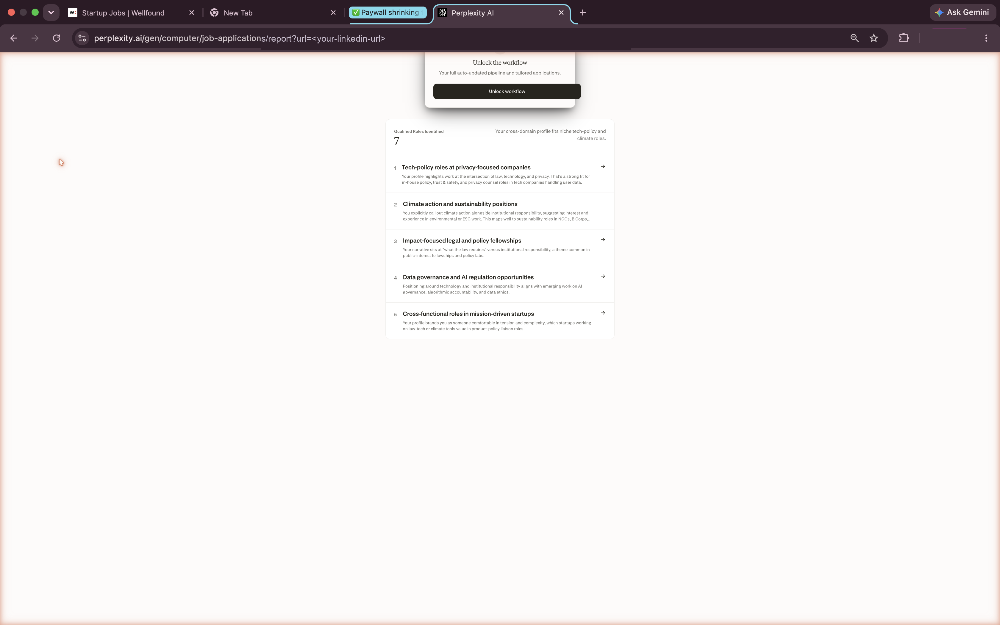
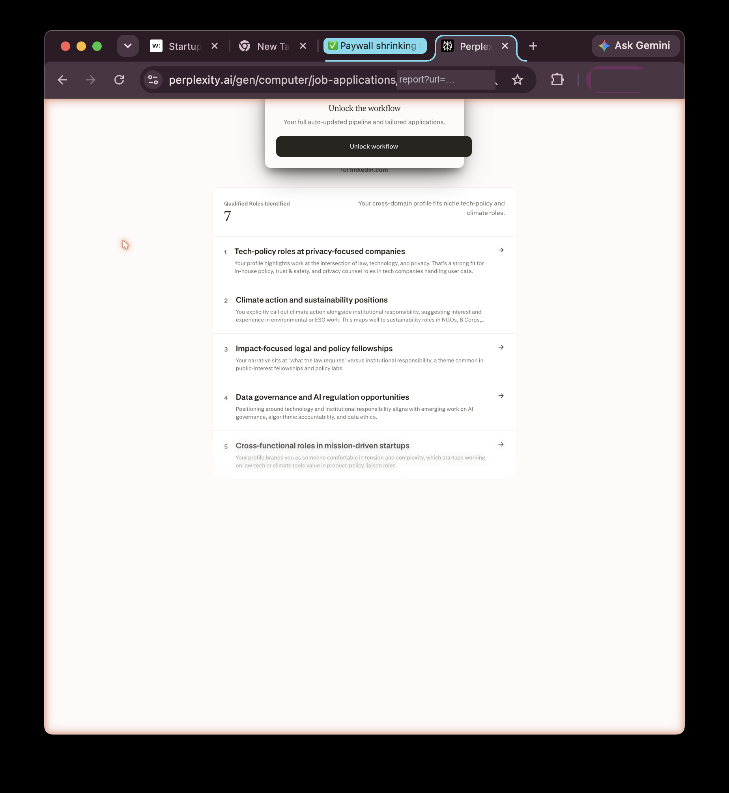

<p align="center">
  
</p>

# perplexed

Perplexity's job-report page (`/gen/computer/job-applications/report`) ends with a frosted panel
that says **Unlock the full workflow** over a blurred stack of result cards. It reads like the good
stuff is behind a paywall.

It isn't. Every card is already in the page, unblurred in the markup — the blur is a translucent
panel painted on top. I started out trying to get past the paywall and realised there was nothing
to get past: the paid feature isn't hidden in the browser, it just isn't there yet. It's generated
after you pay, so there's nothing on the page to un-hide.

What I *did* turn up, while poking at it, were four smaller things worth fixing. None is a security
hole. One of them — a product prompt sitting in a URL — is the kind of thing you'd want to rotate
quietly rather than read about in a search alert.

<p align="center">
  
</p>

## What's actually in the page

- **Five cards, all of them, every time.** The result list is a `role="list"` with exactly five
  `role="listitem"` children in the accessibility tree — counting nodes that are off-screen or under
  the scrim. No sixth item behind `display:none` / `visibility:hidden` / `hidden`, nothing
  truncated. The blur is a blurred scrim layer belonging to the modal, sitting *over* cards whose
  own nodes carry no blur.
- **The "gated" panel is four nodes.** Its entire accessibility subtree:

  ```
  img                                                      (a lock glyph)
  heading   "Unlock the full workflow"
  generic   "Your full job pipeline and tailored applications."
  link      "Unlock workflow"   →   /pro/payment?plan=yearly
  ```

  There's no hidden results container and no lazy-loaded region. The paid pipeline is generated
  server-side after checkout, so there is nothing in the client to reveal.
- **Nothing I did to the layout revealed anything.** 50% zoom, a ~390 px-wide portrait window, and
  deleting the scrim's CSS in devtools all reposition the panel; the list stays at five. You can't
  surface bytes the server never sent.

That last point is the whole reason there's no "bypass" here, and it's why the dead end is written
up honestly in [`findings/METHODOLOGY.md`](findings/METHODOLOGY.md) instead of being deleted.

## The findings

| | Finding | Severity |
|--|---------|----------|
| **F-01** | The advertised count is larger than the list it sits above | Medium |
| **F-02** | The upgrade link carries the full prompt — and your profile URL — in its query string | Low–Medium |
| **F-03** | The panel is pinned to the viewport, so it detaches and clips when you zoom out | Low |
| **F-04** | The panel has no way to close it except the checkout button | Low–Medium |

### F-01 · the count doesn't match the list

The headline and the counter card are driven by an upstream estimate, not by `listItems.length`.
One run read **7** — labelled *Qualified Roles Identified* — directly above five cards; another run
of the same profile read **5**, labelled *Opportunities Identified* (the scrim shot further down).
The list was five both times; the count is the part that moves. Because that number sits right on
top of the *Unlock* button, an inflated count reads as *"the other two are behind the paywall."*
That's the false trail I spent an afternoon following before confirming no sixth or seventh node
exists in any state. Fix: derive the number from the rendered collection, cap it at the render
count, and add a regression assert (`headlineCount === renderedList.length`).
→ [F-01](findings/F-01-count-inconsistency.md)

<p align="center">
  
</p>

### F-02 · the link carries more than a click

The *Unlock workflow* link's `href` is a checkout redirect with the entire product prompt packed,
URL-encoded, into a nested parameter:

```
/pro/payment
  ?plan=yearly
  &origin=computerLanding
  &redirect_path=%2Fcomputer%2Fnew%3Fsource%3Dmarketing%26qfill=<url-encoded prompt>
  &close_path=/gen/computer/job-applications
```

Decode `qfill` and you get the full workflow prompt verbatim — and the user's LinkedIn URL is
interpolated into it. It's mild content on its own (marketing copy, not credentials), but a URL is
the worst possible place to keep it: it lands in browser history, `Referer` headers sent to
third-party origins, analytics / CDN / proxy logs in plaintext, and any copy of the link that gets
shared — carrying the profile URL along every one of those paths.

<p align="center">
  
</p>

Fix: replace the inline `qfill` payload with a server-side template id (`?tmpl=job-pipeline`), carry
the profile URL in a POST body or session rather than the query string, and set
`Referrer-Policy: strict-origin-when-cross-origin` on the surface.
→ [F-02](findings/F-02-prompt-in-query-string.md)

### F-03 · the panel detaches when you zoom

The panel is anchored to the viewport rather than constrained to the report container, so below
~75% zoom, or under ~480 CSS px of width, it detaches from the foot of the list, migrates to the
top of the viewport, and clips against the edge. That crosses WCAG 2.1 SC 1.4.4 (Resize Text) and
1.4.10 (Reflow). Fix: constrain positioning to the container and add `max-height` with internal
scroll so it degrades instead of clipping. → [F-03](findings/F-03-overlay-detaches.md)

### F-04 · the only way out is checkout

The panel exposes no element with an accessible name of "Close" or "Dismiss" and no `Escape`
handler; its only focusable control is the checkout link. It also isn't a conformant dialog — no
`role="dialog"`, no `aria-modal`, no focus trap — while its scrim covers list items 3–5 that are
fully in the DOM and not gated. A promo overlay whose only exit is *pay* is a dark-pattern shape
even when, as here, nothing underneath is really locked; SC 1.4.10 is the relevant bar. Fix: give
it real dialog semantics with a documented exit, or make it non-modal and stop scrimming free
content. → [F-04](findings/F-04-no-dismiss.md)

<p align="center">
  
</p>

## How I looked

Read-only, start to finish: accessibility-tree and page-text reads, plus screenshots at a few zoom
levels and window sizes. No requests replayed, no login, no rate-limit probing — nothing was
defeated to find any of this. The full method, and the hypothesis that turned out to be wrong, are
in [`findings/METHODOLOGY.md`](findings/METHODOLOGY.md).

Screenshots live in [`evidence/`](evidence/); address bars and browser chrome are redacted and the
profile URL is shown as `<your-linkedin-url>`.

## Disclosure

Published without prior coordination — the reasoning, and a ready-to-send report, are in
[`DISCLOSURE.md`](DISCLOSURE.md).

## Reproduce

```
https://www.perplexity.ai/gen/computer/job-applications/report?url=<your-linkedin-url>
```

Use any public LinkedIn profile, then in devtools:

- **F-01** — compare the counter/headline number against the number of rendered `role="listitem"`
  nodes. Regenerate a few times; the list stays at five, the number wanders.
- **F-02** — inspect the *Unlock workflow* anchor's `href` and decode the `qfill` parameter.
- **F-03** — drop to 50% zoom or narrow the window below ~480 px and watch the panel detach.
- **F-04** — tab through the panel and press `Escape`; the only focusable target is the checkout
  link, and nothing dismisses it.
- **The non-finding** — read the accessibility tree *including hidden nodes*: exactly five
  `listitem`s, and a four-node upgrade panel, in every state.

## License

[CC BY 4.0](LICENSE) — reproduce with attribution. Not affiliated with, endorsed by, or sponsored
by Perplexity AI.
